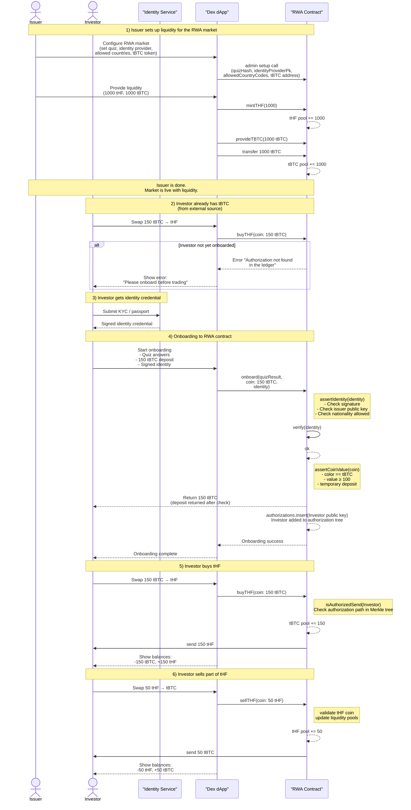

# Brick Towers Real World Asset (RWA) Tokenization

Brick Towers Midnight RWA is an end-to-end showcase of privacy-preserving, real-world-asset tokenization on the Midnight network. The repository includes Midnight Compact contracts for token issuance, accredited investor verification, a credential issuer service, a React front-end, a tBTC faucet, and Midnight wallet integrations that keep user data local while enforcing issuance and trading only to accredited investors (meets knowledge, wealth, nationality and age requirements).

## 📖 Overview

### Problem statement
- Traditional asset classes (RWAs) come with regulatory requirements for issuance, market access, compliance & market integrity
- On-chain tokenization exposes transactions, balances, and identities, risking privacy breaches and regulatory non-compliance.
- Compliance checks, e.g. for accredited investors demand confidentiality without sacrificing liquidity or verifiability.
- Real-world issue: Over $500T in RWAs globally, but regulatory concerns deter on-chain issuance and broader adoption in DeFi.

### Vision
A world where regulated traditional asset classes can be issued and traded on-chain, without revealing holder information and having compliance rules enforced automatically.

### Example 
- tHF tokens: Shielded representations of real-world hedge fund shares, held in issuer custody.
- Core value: Privacy-first finance – transactions, balances, and identities remain confidential, while proofs ensure eligibility.
- Impact: Facilitates regulated RWA investments, allows for opening of corporate balance sheets tokenizing verticals, fosters trust in DeFi, aligns with Midnight's privacy ecosystem for scalable, secure finance.
- Long-term: Expand to multiple asset classes, integrate with global DEXs, partner with regulators for mainstream adoption.

### Roles
- Issuer: Custodian of the real world asset who issues tokens to accredited investors for trading on the blockchain
- Investor: Accredited investor who proves that they are accredited and participate in RWA token trading

### ✅ Key Features
- **Midnight Wallet Integration**: Users can link their identity credentials to their Midnight wallet
- **Decentralized Identity Management**: Users fully own and control their identity credentials
- **Privacy-Preserving Identity Verification**: Verify passport data, age, nationality, and other attributes without exposing the actual data to third parties
- **Secure Signature Verification**: Cryptographic signatures (JubJub elliptic-curve) from trusted issuers guarantee authenticity of identity claims
- **Built on Midnight Blockchain**: Leverages Midnight's Zero-Knowledge infrastructure for maximum privacy
- **On-Chain Age & Identity Checks**: Verify the holder is 18+ and passport is valid using ledger time — no birth date revealed
- **Accreditation Quiz**: Users must pass a risk-awareness quiz before accessing regulated assets
- **Role-Based Access Control**:
   - Only authorized issuers can mint, burn, or provide liquidity
   - Only verified and accredited users can receive tokens

### 🛠 Technical Features (Frontend & UX)
- Modern React + Material-UI interface
- Built-in tBTC Faucet directly on the main page
- Detailed wallet connection feedback
- Step-by-step transaction progress updates
- Clear, user-friendly error messages
- Automatic retry logic for transient network/provider issues
- Robust state recovery (survives page reloads and temporary disconnects)

### 📝 Smart Contract Features
- **Privacy-preserving identity verification** (age, nationality, passport validity) using Zero-Knowledge proofs
- **Elliptic-curve signature verification** of identity claims
- **Modular cryptographic functions** for easy upgrades and audits
- **Accreditation module**: On-chain proof that the user understands risks and regulations
- **Ledger-time-based validation** of age and passport expiration
- **Strict role-based access control** (issuers vs. verified holders)
- **Mint/burn/liquidity controls** restricted to authorized entities only

## 🔍 Technical Architecture

### 📋 Use Case Flow Details



### Monorepo packages

| Package | Purpose | Highlights |
| --- | --- | --- |
| `rwa-contract/` | Midnight Compact contract plus TypeScript bindings | Circuits in `midnight-rwa.compact`, Vitest simulators (`midnight-rwa-simulator.ts`), witness exports, LevelDB store for private state |
| `tbtc-contract/` | Faucet contract for demo tBTC | Single `mint` circuit, shares build pipeline with RWA contract |
| `identity-api/` | Credential issuer / IDP stub | `credential-signer.ts` issues `PassportData`, webpack build + `serve` script for local HTTP API |
| `rwa-api/` | Contract SDK consumed by the UI | RxJS-based state streams, deploy/subscribe helpers, TypeScript definitions shared with the UI |
| `rwa-ui/` | React front-end (shop + IDP pages) | Midnight wallet wrapper, proof client wiring, catalog UX, runtime configuration loader, ZK artifacts copy scripts |

Additional assets include `docs/` (screenshots) and `turbo.json`, which orchestrates `compact`, `build`, `test`, and `lint` tasks across workspaces.

## 🪛 Build

### Prerequisites

- [Midnight Compact compiler](https://docs.midnight.network/develop/tutorial/building/prereqs#midnight-compact-compiler) (`COMPACT_HOME` must be set)
- [Node.js LTS](https://nodejs.org/en/download/) and [Yarn](https://yarnpkg.com/getting-started/install)
- [Docker](https://docs.docker.com/get-docker/) for Midnight indexer & local nodes (when running full-stack)

### Install & compile

```bash
yarn install
npx turbo run compact
npx turbo run build
```

### Workspace tips

- **Contracts**: `yarn workspace @bricktowers/rwa-contract compact && yarn workspace @bricktowers/rwa-contract build`
- **tBTC faucet**: `yarn workspace @bricktowers/tbtc-contract compact && yarn workspace @bricktowers/tbtc-contract build`
- **Run Identity Provider API**: `yarn workspace @bricktowers/identity-api build && yarn workspace @bricktowers/identity-api serve`
- **Run UI**: `yarn workspace @bricktowers/rwa-ui build && yarn workspace @bricktowers/rwa-ui start`
  - The UI build automatically copies proving keys from both contracts via the `copy-*` scripts.
- **Runtime config**: edit `rwa-ui/public/config.json` to point at your indexer URLs, contract addresses, and Firebase/AppCheck values before running `vite preview` or `http-server`.

## 🧪 Test

```bash
npx turbo run test
yarn workspace @bricktowers/rwa-contract test          # Vitest simulators
yarn workspace @bricktowers/tbtc-contract test         # Faucet circuit tests
yarn workspace @bricktowers/rwa-api test               # Jest + testcontainers
yarn workspace @bricktowers/identity-api test          # Credential converters/signers
```

Tests rely on the generated `managed/` artifacts, so run `npx turbo run compact` first or use the `test:compile` scripts inside each contract workspace to recompile before executing Vitest.
